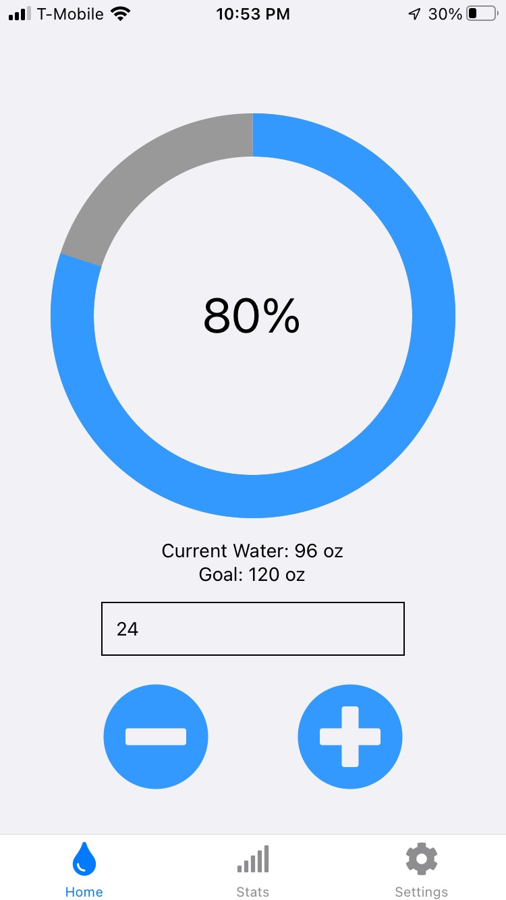
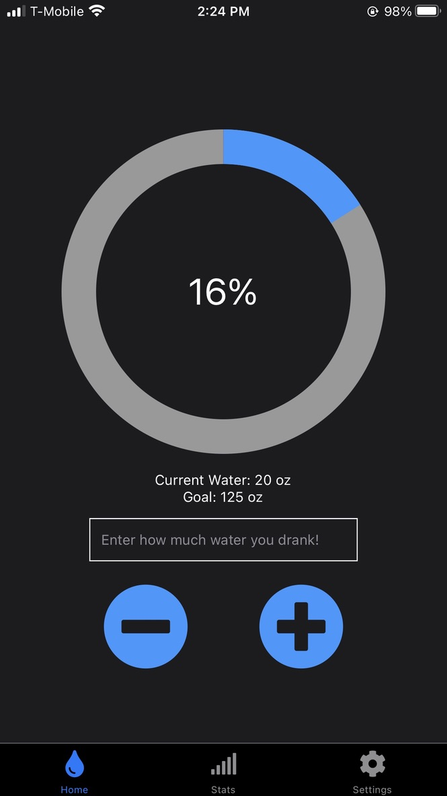
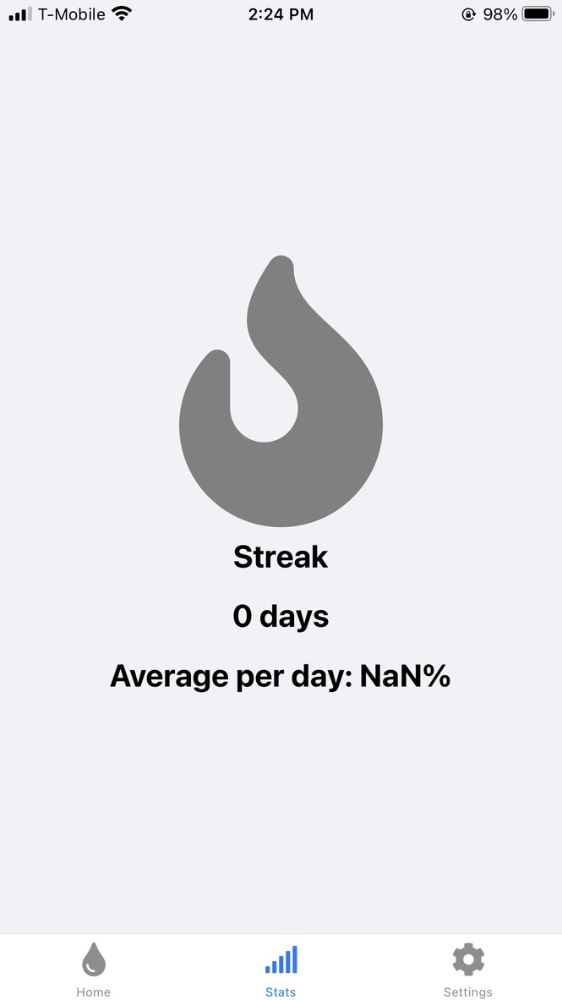
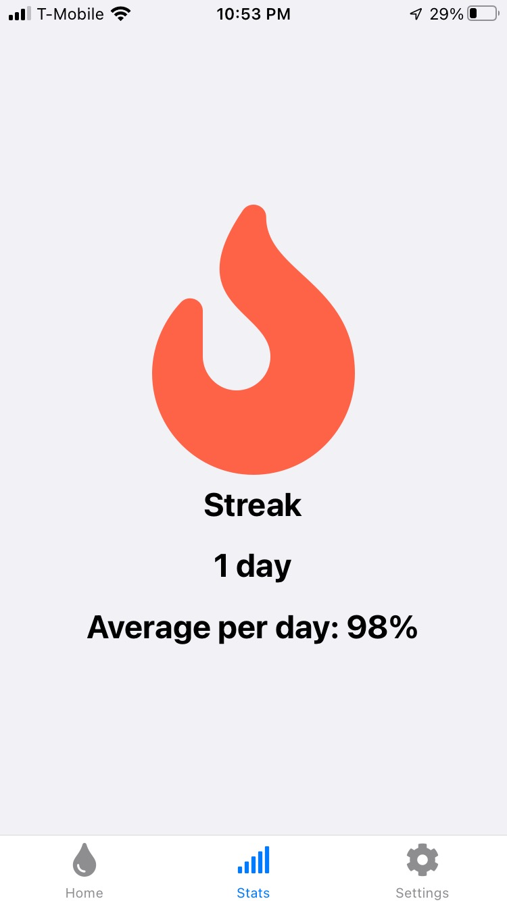
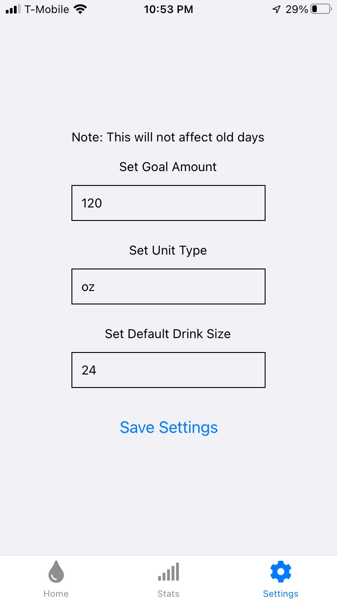

# Water Tracker

## About

I created this app with the purpose of learning more about creating apps with React Native. I wanted to create something that would be useful to me as well.

## Features

The app stores your data locally using MongoDB's Realm. This allows for the user to store everything without having to sign up for an account, or worrying about the app's server eventually shutting down. The average uses the previous 7 days to calculate how much water you have been drinking.

I chose to not specify a particular unit for the app, which allows you to track in terms of 'bottles' as well, if you like.

Dark mode supported as well!

## Screenshots

